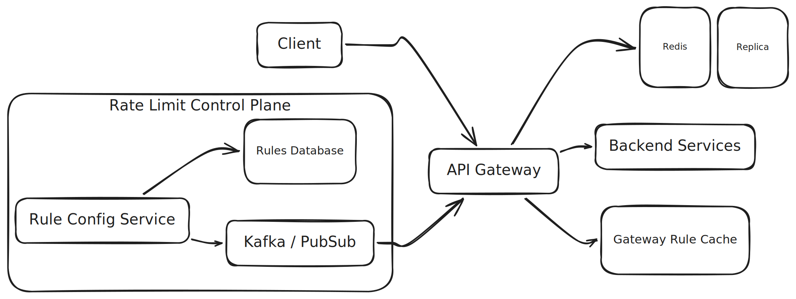

# Designing a Distributed Rate Limiting System

I want to practice my system design skills and I figured a good way to do that would be to write about system designs. Practice makes perfect, right?
For this first post I figured I would start off with a class: design a rate limiter. I like this problem because it is very general and is critical 
for any large scale system handling lots of requests. For system designs, I follow [Hello Interview's 6-step framework](https://www.hellointerview.com/learn/system-design/in-a-hurry/delivery).

## Problem Statement

A company runs a high-traffic system with lots of users making lots of requests. As the company scales, they want to protect their backend from excessive requests. A rate limiter is a natural solution.

### Functional Requirements

Design a system that allows us to limit how many requests a client can make within a given time window.

The system should:

- Track request counts per client
- Allow or reject requests based on configured limits
- Support multiple rate limiting policies
- Allow administrators to update rate limit rules
- Return useful metadata to clients

Example response:

```http
HTTP/1.1 429 Too Many Requests

X-RateLimit-Limit: 100
X-RateLimit-Remaining: 0
X-RateLimit-Reset: 60
```

### Non-functional Requirements

- < 10ms latency for request rate limit checks
- Handle 500K req/sec
- Availability over consistency (CAP theorem)

### Core Entities

In this design, there are only a few key entities we care about:

- Request
- User (user ID, API token, IP address)
- Rate limit rules (premium users have 300 req/min)

For now, we will assume we are rate limiting on user ID.

### Interface

Given a request, we want to determine whether or not it should be rate limited:

- `bool isRequestValid(userId)`: returns `true` if the request should go through, `false` if it should be rate limited

### Data Flow

Real simple in this case: a client makes a call to one of our APIs and we need to return something.

### High-level Design

The diagram below outlines the rate limiter system design:



[Link to Excalidraw](https://excalidraw.com/#json=NpIv2DfUsNg6Oh1KZ8wQH,1JhOyyH1oj2p5BOPGhB_NQ)

#### Deliberate Decisions

In this design, I want to mention a number of _deliberate_ design choices. First is where rate limiting is handled. By placing the rate limiting logic in the API gateway, we avoid any latency that might be added by calling a dedicated rate limit service. 
The main source of latency we have is a call to a Redis shard which we can mitigate by [pooling connections](https://en.wikipedia.org/wiki/Connection_pool). This architecture also allows for simple tracking of requests by user across our whole system. If the solution 
was to have each service manage its own rate limits, each service would be unaware of requests made to other services from the same user.

Second is how rules are designed. In this system, rules can be updated on the fly with no disruption. This works by adding a rule configuration service which publishes rules which are then pushed to the API Gateway. The API Gateway can manage its own rule cache for quick access.

#### Rate Limiting Algorithms

There are a number of algorithms used for rate limiting but here I'll just outline 3:

1. Fixed Window

Bucket incoming requests into distinct intervals. If the interval request count exceeds the request limit, reject the request. Each time the interval increments, it resets.

2. Sliding Window

This strategy is similar to the fixed window strategy, except the interval is dynamic, so earlier requests eventually exit the window and allow for additional requests to be made.

3. Token Refill

Each user has a pool of tokens which has a set maximum capacity and is always refilling at a set fixed rate (but will never exceed capacity). As the user makes requests, tokens are removed from their pool. If the user has 
no remaining tokens, reject the request.

### Deep Dives

As a reminder, here are the non-functional requirements set for this system:

- < 10ms latency for request rate limit checks
- Handle 500K req/sec
- Availability over consistency (CAP theorem)

I will address these non-functional requirements

**< 10ms latency for request rate limit checks**

For low latency, there are a couple of things to note. First of all, our system should not have to make any expensive requests to a database or any other API. We can encode the user ID in the request's JWT, pool Redis connections, and lightning fast rate limiting algorithms. This should make the end-to-end check very fast.

**Handle 500K req/sec**

In order to handle high volume, we can shard Redis instances by user ID. If we have 10 shards, each shard will handle ~50K req/sec which should be manageable. Whichever algorithm is selected to rate limit, it should be extremely efficient and we should well exceed the 500K req/sec requirement.

**Availability over consistency (CAP theorem)**

For availability in our system, there are a few things. In the event the rate limiting mechanism fails entirely, the system should either allow all requests or reject all requests. This should be determined based on the type of application.
Replication can be used to improve resiliency. In Redis, each primary node (or primary shard, in a sharded Redis Cluster) can have one or more replica nodes. The primary asynchronously replicates writes to its replicas, allowing a replica to be promoted if the primary fails.